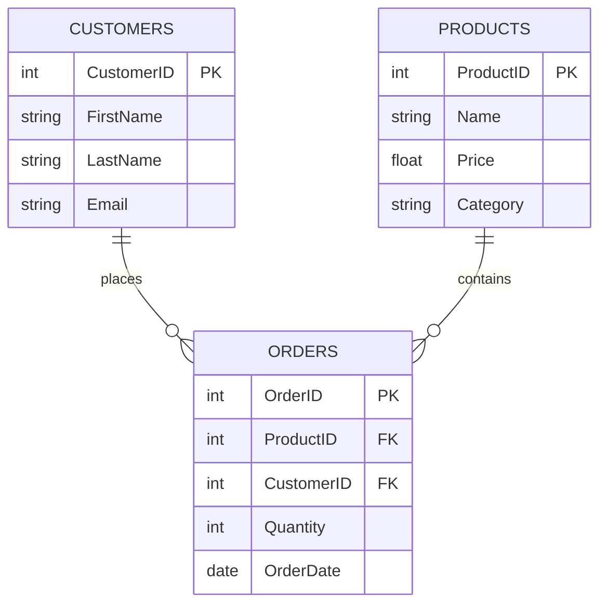

# Projekt report SQL:

- Skapa ny tabell Kunder

```sql
CREATE TABLE Customers (
  CustomerID INT PRIMARY KEY,
  FirstName VARCHAR(50),
  LastName VARCHAR(50),
  Email VARCHAR(100)
);

```

- Lägg till data i alla tabeller

 ```sql

INSERT INTO Products (ProductID, Name, Price, Category) VALUES
(1, 'Wireless Mouse', 299.00, 'Electronics'),
(2, 'Bluetooth Speaker', 499.00, 'Electronics'),
(3, 'Notebook', 39.00, 'Stationery'),
(4, 'Desk Lamp', 199.00, 'Home'),
(5, 'Water Bottle', 89.00, 'Fitness');

INSERT INTO Customers (CustomerID, FirstName, LastName, Email) VALUES
(1, 'Anna', 'Svensson', 'anna.svensson@example.com'),
(2, 'Johan', 'Lindberg', 'johan.lindberg@example.com'),
(3, 'Sara', 'Nilsson', 'sara.nilsson@example.com');

INSERT INTO Orders (OrderID, ProductID, CustomerID, Quantity, OrderDate) VALUES
(1, 1, 1, 2, '2025-11-01'),
(2, 3, 2, 5, '2025-11-03'),
(3, 2, 1, 1, '2025-11-05'),
(4, 5, 3, 3, '2025-11-07'),
(5, 4, 2, 1, '2025-11-10');

```
## Normalisering och Visualisering

## Normalisering
- **1NF:** Alla tabeller har atomära värden, inga upprepade grupper.  
- **2NF:** Alla icke-nyckelattribut beror helt på primärnyckeln.  
- **3NF:** Inga transitiva beroenden, attribut beror endast på primärnyckeln.  
## databasen
- `Products` lagrar en produkt per rad (1NF).  
- `Orders` har attribut som beror på `OrderID` (2NF).  
- `Customers` lagrar e-post separat, inga transitiva beroenden (3NF).  

## Visualisering
ER-diagrammet visar relationerna mellan tabellerna:

- En kund kan ha flera ordrar.
- En produkt kan förekomma i flera ordrar.
- Tabell `Orders` fungerar som en kopplingstabell mellan `Customers` och `Products`.


# SQL-Skript och Användbarhet:

## 1. Visa alla produkter from products

```sql
SELECT * FROM Products;
```


-- 2. Visa alla produkter, även de som inte har blivit beställda
```sql
SELECT 
  p.ProductID,
  p.Name,
  o.OrderID
FROM Orders o
RIGHT JOIN Products p ON o.ProductID = p.ProductID;
```


-- 3. visa kunder med specifika LastName

```sql
SELECT * FROM Customers
WHERE LastName = 'Svensson';
```


-- 4. visa produkter billigare än 100

```sql
SELECT * FROM Products
WHERE Price < 100;
```


-- 5. räkna totala antalet kunder
```sql
SELECT COUNT(*) AS TotalCustomers
FROM Customers;
```


-- Returnerar det totala antalet kunder.

-- 6.Hitta det genomsnittliga produktpriset
```sql
SELECT AVG(Price) AS AveragePrice
FROM Products;
```


-- Beräknar genomsnittspriset för alla produkter.

-- 7.Visa beställningar med kundnamn
```sql
SELECT o.OrderID, c.FirstName, c.LastName
FROM Orders o
JOIN Customers c ON o.CustomerID = c.CustomerID;
```


-- Kombinerar beställningar och kunder för att visa vem som lagt varje beställning.

-- 8. Visa de 5 dyraste produkterna
````sql
SELECT Name, Price
FROM Products
ORDER BY Price DESC
LIMIT 5;
````


# Del 2: Stored Procedure

-- använd Databasen här to skapar procedure
```sql
use exam_b
```
-- Create procedure
```sql
CREATE PROCEDURE GetCustomerOrders(IN p_CustomerID INT)
BEGIN
    SELECT 
        o.OrderID,
        p.Name AS ProductName,
        o.Quantity,
        p.Price,
        (o.Quantity * p.Price) AS TotalAmount,
        o.OrderDate
    FROM Orders AS o
    INNER JOIN Products AS p ON o.ProductID = p.ProductID
    WHERE o.CustomerID = p_CustomerID
    ORDER BY o.OrderDate;
END;
```
-- check with procedure is exist or not
```sql
SHOW PROCEDURE STATUS WHERE Db = 'exam_b';
```


-- execute Procedure
```sql
CALL GetCustomerOrders(1);
```


# Del 3: Prestandaanalys:
-- Valde SQL queri 8  fem dyra produkter och analys genom EXPLAIN
### Effekt av index på frågan:

 **Utan index:**  
  Databasen gör en fullständig tabellskanning och sorterar alla rader innan de fem dyraste produkterna returneras. Detta blir ineffektivt när antalet produkter växer eftersom hela tabellen måste läsas och sorteras.

 **Med index på `Price`:**  
  Databasen kan använda en **Index Scan** eller en **Top-N sort**, vilket gör att de fem högsta priserna kan hämtas direkt utan att sortera hela tabellen. Detta minskar både läs- och sorteringskostnaden och gör frågan betydligt snabbare och mer skalbar.
```sql
CREATE INDEX idx_products_price ON Products(Price);
```
## EXPLAIN 
Det är SQl Kommando som användas för att analysera hur databasen planera
-- sorterar dyreste produkter och ha möjlighet jämföra **före och efter optimering** för att se förbättringar
hjälper till att databasen använder **index** eller inte
```sql
EXPLAIN SELECT Name, Price
FROM Products
ORDER BY Price DESC
LIMIT 5;
```


## Del 4: Användarhantering och Säkerhet
-- Vi ska skapa ny användere för att öka säkerheten i databasen 
```sql
-- Skapa en ny användare
CREATE USER 'readonly_user'@'localhost' IDENTIFIED BY 'securepassword';

-- Ge användaren SELECT-behörighet på databasen "shopdb"
GRANT SELECT ON shopdb.* TO 'readonly_user'@'localhost';

-- Uppdatera rättigheter
FLUSH PRIVILEGES;
```
-- Skapa en backup databasen genom att använda mysqldump
```sql
-- Kör i terminalen
mysqldump -u root -p shopdb > shopdb_backup.sql
```
-- Inhåller tabell stureture och data shopdb_backup
```sql
-- Ta bort databasen
DROP DATABASE shopdb;
```
-- Återställer databasen från backupen
 ```sql
-- Kör i terminalen
mysql -u root -p < shopdb_backup.sql
```


